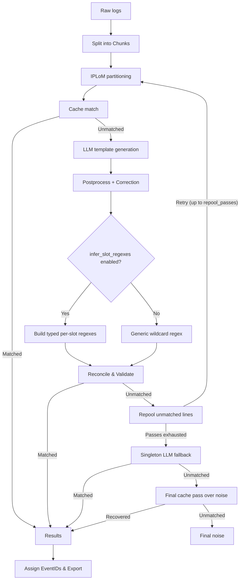

# IPLoM LLM Parser

A log parsing pipeline that combines fast syntactic clustering (IPLoM [^1] [^2])
with LLM-based template extraction without labeled data.

[^1]: Makanju, A. A. O., Zincir-Heywood, A. N., & Milios, E. E. (2009). Clustering event logs using iterative partitioning. Proceedings of the 15th ACM SIGKDD International Conference on Knowledge Discovery and Data Mining, KDD ’09, 1255–1264. https://doi.org/10.1145/1557019.1557154
[^2]: Makanju, A., Zincir-Heywood, A. N., & Milios, E. E. (2012). A Lightweight Algorithm for Message Type Extraction in System Application Logs. IEEE Transactions on Knowledge and Data Engineering, 24(11), 1921–1936. https://doi.org/10.1109/TKDE.2011.138


## Quick start

```bash
uv sync
source .venv/bin/activate
```


```python
import polars as pl

from src.config import Config, LLMConfig, PipelineConfig, IPLoMConfig, load_config
from src.llm_client import LLMClient
from src.pipeline import TemplatePipeline, write_output


config = load_config("config.toml")
# Alternatively without a config file:
# config = Config(
#     pipeline=PipelineConfig(),
#     iplom=IPLoMConfig(),
#     llm=LLMConfig(
#         provider="local",
#         model="org/some-model",
#         base_url="http://localhost:1234/v1",
#     ),
# )

# content_col determines which column of df is parsed into templates
df = pl.read_csv("my_logs.csv")

with LLMClient(config.llm) as client:
    pipeline = TemplatePipeline(config.pipeline, config.iplom, client, df)
    df_res = pipeline.run()

print(df_res.head())
print(pipeline.stats) # RunStats: llm_calls, input_tokens, output_tokens,
                      #           total_time, matched, noise

write_output(df_res, "output.csv")
```

## Output (`df_res`)

| Column           | Meaning                                                                 |
|-----------------|-----------------------------------------------------------------------------------------|
| `LineId`        | Original line identifier (uses your data's `LineId` column if present, otherwise the internal row index) |
| `EventId`       | `E1`, `E2`, ... assigned per unique template; `null` for noise           |
| `Content`       | The original raw log line/message                                        |
| `EventTemplate` | The inferred template, e.g. `Connecting to <*>:<*> as user <*>`; `null` for noise |
| `ParameterList` | The values that filled each `<*>`, in template order e.g. `"['127.0.0.1', '8000', 'admin']"` |
| `SlotTypes`     | The semantic type of each slot, in the same order e.g. `"['LOI', 'LOI', 'OID']"` |

> [!WARNING]
> Currently the amount of `SlotTypes` might be inconsistent with the resulting template, if `template_correction` is on. 
> Template correction might combine two variables into one (e.g. `<IP>:<PORT> -> <VAR>`).

**Noise rows** (lines that never matched any template, even after all
repool passes) have `EventTemplate`, `ParameterList`, and `SlotTypes` all
`null`. Filter if you need it:

```python
noise_df = df_res.filter(pl.col("EventTemplate").is_null())
```

## Configuration (`config.toml`)

```toml
[pipeline]
content_col = "Content"               # df column used to extract log template
chunk_size = 5000                     # rows processed per chunk
llm_sample_n = 10                     # sample size per partition sent to the LLM
repool_passes = 3                     # retries for unmatched rows
template_correction = true            # apply regex cleanup rules to LLM-generated templates
infer_slot_regexes = true             # build typed per-slot regexes instead of generic one

[llm]
provider = "local"                    # "local" or "openrouter"
model = "google/gemma-4-12b-qat"
max_concurrent = 4
timeout = 60
max_tokens_per_log = 0                # truncate logs exceeding max tokens; 0 for off
base_url = "http://localhost:1234/v1" # required when provider = "local"
prompt = "default"                    # default, simple or no_example

[iplom]
CT = 0.3
lower_bound = 0.25
```

## API key

OpenRouter API key is read from `API_KEY` environment variable. If ran locally API key is usually not
needed unless your local server has been configured to require it. Categories based o

For example:
```bash
API_KEY=sk-or-v1-... python3 main.py
```

## Local model requirements

- Support OpenAI compatible endpoints (chat completions)
- Support structure output (tool calls)
- Be reachable at `base_url`

The pipeline tries to disable reasoning and set temperature to zero, but 
depending on the model, this might not always be possible. 
You might need to change them in the model configuration on your server.


## Placeholder types

With the default prompt, the LLM is prompted to classify each dynamic value into one of these typed
placeholders (`SlotTypes` output column). Variable categories are based on classification by Li et al. (2023) [^3].

[^3]: Li, Z., Luo, C., Chen, T.-H., Shang, W., He, S., Lin, Q., & Zhang, D. (2023). Did We Miss Something Important? Studying and Exploring Variable-Aware Log Abstraction. 2023 IEEE/ACM 45th International Conference on Software Engineering (ICSE), 830–842. https://doi.org/10.1109/ICSE48619.2023.00078


| Tag     | Meaning                                          |
|---------|--------------------------------------------------|
| `<OID>` | Session IDs, user IDs, etc.                      |
| `<LOI>` | Paths, URIs, IP addresses                        |
| `<OBN>` | Object names, task names, job names              |
| `<TID>` | Type indicators                                  |
| `<SID>` | Numerical switch/flag indicators                 |
| `<TDA>` | Timestamps, durations                            |
| `<CRS>` | Memory, disk space, byte counts                  |
| `<OBA>` | Counts of objects (errors, nodes, etc.)          |
| `<STC>` | Numerical error/status codes                     |
| `<OTP>` | Any other dynamic value                          |


## Pipeline



